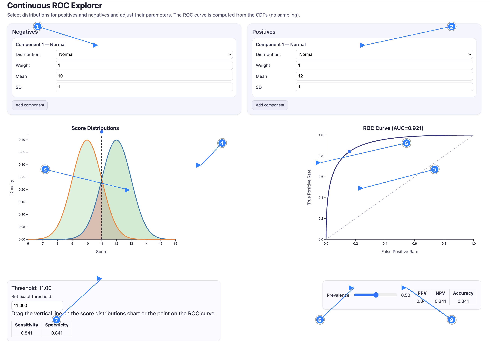
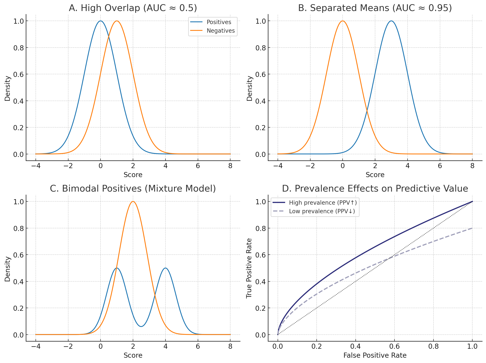
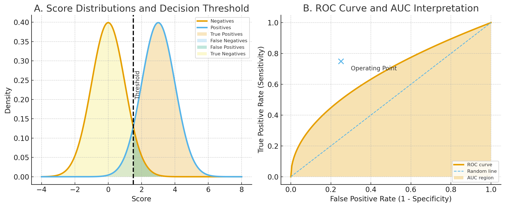
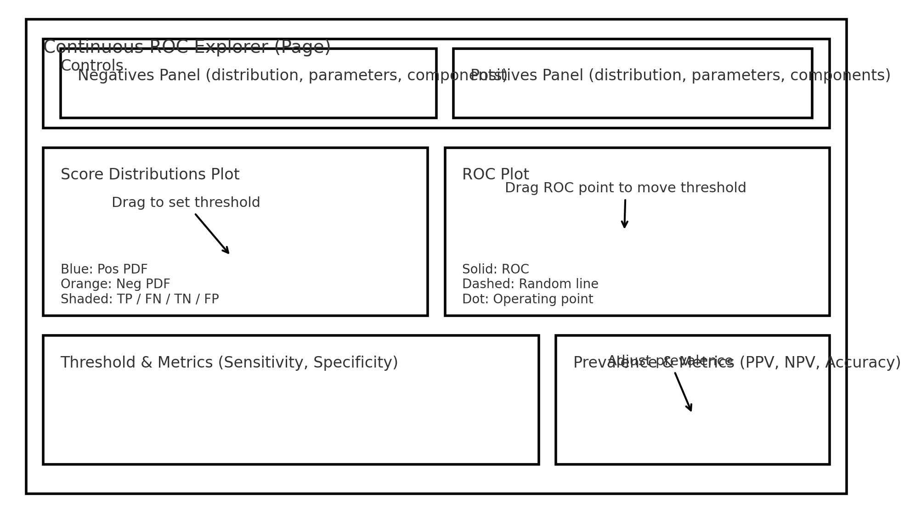

# Continuous ROC Explorer – User & Teacher Guide

> **Abstract** — The *Continuous ROC Explorer* is an interactive, browser-based platform for teaching ROC analysis. It analytically computes ROC curves from user-defined continuous distributions, supports prevalence-dependent metrics, and provides tools for dynamic visualization, scenario saving, and classroom customization. This document serves as both a user manual and a developer reference, including teacher customization guides, metric definitions, and Codex implementation checklists.
 – User & Teacher Guide

## Overview

The **Continuous ROC Explorer** is an interactive web app for teaching and visualizing **Receiver Operating Characteristic (ROC)** curves. Unlike sample-based ROC tools, this app computes the curve analytically from the **cumulative distribution functions (CDFs)** of user-defined positive and negative score distributions.

Teachers and students can explore how different distributions, thresholds, and prevalences influence **sensitivity**, **specificity**, **PPV/NPV**, and the **AUC (Area Under the Curve)**.

---

## Quick Start

1. Open `continuous_ROC.html` in a modern browser (Chrome, Firefox, Edge, or Safari).
2. The app automatically loads its configuration from `continuous_ROC_config.js`.
3. Adjust the parameters for **positives** and **negatives** using the provided controls.
4. Drag the vertical threshold line or the ROC point to see how metrics change.
5. Use the **Prevalence** slider to explore population-level effects.

---

## Key Concepts

- **Positives** and **Negatives**: Two classes represented by user-defined distributions.
- **Threshold**: Score value that separates predicted positives from negatives.
- **ROC Curve**: Plots the trade-off between False Positive Rate (FPR) and True Positive Rate (TPR).
- **AUC (Area Under Curve)**: Quantifies discrimination ability; higher AUC indicates better separation.
- **Prevalence**: Fraction of true positives in the population, used to compute PPV, NPV, and accuracy.

---

## App Interface

### Distribution Controls
- Choose a distribution type (Normal, Beta, Gamma, etc.).
- Adjust distribution parameters using numeric input fields.
- For multi-component models, adjust **weights** to define mixtures.

### Plots
- **Left:** Score Distributions (positives in blue, negatives in orange)
- **Right:** ROC Curve (interactive point corresponding to current threshold)

### Metrics
- **Top Table:** Sensitivity and Specificity (threshold-dependent)
- **Bottom Table:** PPV, NPV, and Accuracy (prevalence-dependent)

### Interactions
- **Drag** the vertical threshold line or ROC point to change the threshold.
- **Enter** an exact threshold value in the input box.
- **Adjust** prevalence using the slider.

---

## Teacher Customization Guide

The app’s behavior, default setup, and appearance are controlled by the configuration file: `continuous_ROC_config.js`.

### 1. Configuration Structure

| Section | Purpose |
|----------|----------|
| `STRINGS` | UI labels and text (localization and terminology) |
| `FEATURES` | Feature toggles for multi-component models |
| `DISTRIBUTIONS` | Available probability distributions with their parameter definitions |
| `DISTRIBUTION_ORDER` | The order in which distributions appear in menus |
| `DEFAULT_OPTIONS` | The initial distributions, threshold, and prevalence |

### 2. Changing Defaults

To set default distributions and parameters:

```js
DEFAULT_OPTIONS.positives = {
  distribution: "beta",
  parameters: { a: 3, b: 2 }
};

DEFAULT_OPTIONS.negatives = {
  distribution: "beta",
  parameters: { a: 2, b: 3 }
};

DEFAULT_OPTIONS.threshold = 0.5;
DEFAULT_OPTIONS.prevalence = 0.5;
```

### 3. Allowing or Disabling Mixture Components

To **disable multi-component mixtures** (use single distributions only):

```js
FEATURES.allowMultiComponents = false;
```

To **set limits** on mixtures:

```js
FEATURES.maxComponents = 3;  // maximum components per class
FEATURES.defaultComponents = 1;  // initial count
```

### 4. Adding a New Distribution

You can define new distributions in the `DISTRIBUTIONS` object. Each must specify:
- A label (for menus)
- Parameters (with labels, types, default values)
- PDF, CDF, and domain functions

**Example: Add Log-Normal Distribution**

```js
DISTRIBUTIONS.lognormal = {
  label: "Log-Normal",
  supportsMulti: true,
  parameters: [
    { id: "meanlog", label: "Mean (log)", type: "number", value: 0, step: 0.1 },
    { id: "sdlog", label: "SD (log)", type: "number", value: 1, step: 0.1, min: 0.001 }
  ],
  pdf: (p, x) => jStat.lognormal.pdf(x, p.meanlog, p.sdlog),
  cdf: (p, x) => jStat.lognormal.cdf(x, p.meanlog, p.sdlog),
  domain: () => [0, 20]
};

DISTRIBUTION_ORDER.push("lognormal");
```

### 5. Changing UI Text and Language

Edit the `STRINGS` section to rename UI elements or localize them to another language. For example:

```js
STRINGS.controls.positivesTitle = "True Positives";
STRINGS.controls.negativesTitle = "True Negatives";
STRINGS.plots.rocYAxis = "Sensitivity";
```

### 6. Adjusting Colors and Styles

All visual styling is defined in the `<style>` section of `continuous_ROC.html`. Teachers can modify these directly or link to an external CSS file.

### 7. Feature Toggles

| Feature | Description |
|----------|-------------|
| `allowMultiComponents` | Enables/disables multi-distribution mixtures |
| `enforceWeightSum` | Normalizes weights to sum to 1 |
| `maxComponents` | Sets upper limit for mixture size |
| `defaultComponents` | Defines how many components appear initially |

---

## Advanced Customization

- **Predefined Scenarios:** Instructors can create alternate configuration files for specific lessons (e.g., `config_high_overlap.js`, `config_low_auc.js`) and load them dynamically by modifying the `<script src>` line.
- **Export & Reset:** Optional enhancements can be added for saving configurations or resetting defaults.
- **Sampling Mode (Future):** Teachers may request an extension that compares sampled vs. analytic ROC curves.

---

## Suggested Exercises

1. **Symmetric Normal Distributions** – Set both distributions to Normal(0,1) and observe the ROC (AUC ≈ 0.5).
2. **Separated Means** – Increase the mean of the positive distribution and note AUC changes.
3. **Mixtures** – Combine two Normal components to simulate bimodal data.
4. **Prevalence Effects** – Change prevalence and observe PPV/NPV dynamics.

---

## Figures

**Figure 4 – Annotated App Screenshot (Numbered Callouts)**  


**Legend**  
1. **Negatives Controls** – Select distribution(s), set parameters, adjust mixture weights.  
2. **Positives Controls** – Select distribution(s), set parameters, adjust mixture weights.  
3. **Score Distributions Plot** – PDFs for positives (blue) and negatives (orange).  
4. **Threshold Line** – Drag to move the decision threshold; areas reflect TP/FN/TN/FP.  
5. **ROC Curve** – Analytic ROC computed from the CDFs.  
6. **ROC Point** – Draggable operating point linked to the threshold.  
7. **Threshold & Metrics** – Prevalence-independent metrics table.  
8. **Prevalence Slider** – Adjusts prevalence for predictive metrics.  
9. **Predictive Metrics** – Prevalence-dependent table.

---

**Figure 3 – Pedagogical ROC Scenarios**  


Four canonical teaching scenarios:
1. *High Overlap (AUC ≈ 0.5)* – Demonstrates poor discrimination.
2. *Separated Means (AUC ≈ 0.95)* – Excellent classifier with minimal overlap.
3. *Bimodal Positives* – Shows how mixtures create complex ROC shapes.
4. *Prevalence Effects* – ROC unchanged, but PPV/NPV vary with prevalence.

---

**Figure 3 – Pedagogical ROC Scenarios**  


Four canonical teaching scenarios:
1. *High Overlap (AUC ≈ 0.5)* – Demonstrates poor discrimination.
2. *Separated Means (AUC ≈ 0.95)* – Excellent classifier with minimal overlap.
3. *Bimodal Positives* – Shows how mixtures create complex ROC shapes.
4. *Prevalence Effects* – ROC unchanged, but PPV/NPV vary with prevalence.

---

**Figure 1 – Conceptual ROC Teaching Panels**  


*Panel A:* Overlapping score distributions with a labeled decision threshold. Shaded regions indicate TP, FP, TN, FN.  
*Panel B:* ROC curve with the random-classifier diagonal and AUC region shaded; a dot marks the operating point.

**Figure 2 – App Layout and Key Interactions**  


An annotated schematic of the app UI showing Controls (Negatives/Positives panels), the Score Distributions and ROC plots, and the Threshold/Prevalence metric areas. Arrows indicate draggable elements and interactive behaviors.

---

## Quick Teacher Setup

### Step-by-Step Setup

1. **Download** both files:
   - `continuous_ROC.html`
   - `continuous_ROC_config.js`
2. **Place** them in the same folder.
3. **Open** the HTML file in a web browser — the app should load automatically.
4. **Modify** `continuous_ROC_config.js` to adjust default distributions or features.
5. **Refresh** the page to apply any configuration changes.

### Classroom Scenario Ideas

| Scenario | Configuration | Teaching Goal |
|-----------|----------------|----------------|
| **Baseline ROC** | Both distributions Normal(0,1) | Demonstrate random classifier (AUC = 0.5) |
| **High Separation** | Positives: Normal(1,1); Negatives: Normal(0,1) | Show how separation increases AUC |
| **Low Prevalence** | Prevalence = 0.1 | Illustrate PPV/NPV sensitivity to rare events |
| **Bimodal Positives** | Two-component positive mixture | Teach multimodal distributions and overlapping regions |
| **Parameter Sensitivity** | Vary parameters interactively | Emphasize how ROC depends on score distributions, not prevalence |

---

## Metrics Reference

### Prevalence-Independent Metrics
| Metric | Formula / Definition | Notes |
|---------|----------------------|-------|
| **True Positive Rate (TPR)** | TP / (TP + FN) | Sensitivity / Recall / Hit Rate |
| **True Negative Rate (TNR)** | TN / (TN + FP) | Specificity / Selectivity |
| **False Positive Rate (FPR)** | FP / (FP + TN) | 1 − Specificity |
| **False Negative Rate (FNR)** | FN / (FN + TP) | 1 − Sensitivity |
| **Positive Likelihood Ratio (LR⁺)** | TPR / FPR | Undefined when FPR = 0 |
| **Negative Likelihood Ratio (LR⁻)** | FNR / TNR | Undefined when TNR = 0 |
| **Youden’s J Statistic** | TPR + TNR − 1 | Distance from chance line |
| **Balanced Accuracy** | (TPR + TNR) / 2 | Robust for imbalanced data |
| **Diagnostic Odds Ratio (DOR)** | (TPR × TNR) / (FPR × FNR) | Diverges when FPR or FNR → 0 |
| **Matthews Correlation Coefficient (MCC)** | (TP×TN − FP×FN) / √((TP+FP)(TP+FN)(TN+FP)(TN+FN)) | Symmetric; bounded in [−1, +1] |
| **Area Under Curve (AUC)** | ∫TPR dFPR | Already implemented analytically |

### Prevalence-Dependent Metrics
| Metric | Formula / Definition | Notes |
|---------|----------------------|-------|
| **Positive Predictive Value (PPV)** | TP / (TP + FP) | Precision; depends on prevalence |
| **Negative Predictive Value (NPV)** | TN / (TN + FN) |  |
| **Accuracy** | (TP + TN) / (TP + TN + FP + FN) |  |
| **Error Rate** | 1 − Accuracy |  |
| **F₁ Score** | 2 × (PPV × TPR) / (PPV + TPR) | Harmonic mean of precision & recall |

### Metrics Requiring Clarification
The following metrics require additional design decisions or optional inputs before implementation:

1. **Cohen’s Kappa** – Needs a consistent definition for expected accuracy under random labeling.  
2. **Markedness** – Defined as PPV + NPV − 1; depends indirectly on prevalence.  
3. **Informedness** – Identical to Youden’s J; decide whether to alias or omit.  
4. **Prevalence-Weighted Balanced Accuracy** – Weighted average of TPR and TNR using prevalence.  
5. **Post-Test Probabilities** – Requires Bayes’ theorem; handle LR = ∞ or 0 cases.  
6. **Expected Cost / Utility** – Needs user-specified FP/FN cost parameters.  
7. **Bias Index / PABAK** – Derived from overall accuracy; primarily pedagogical.  
8. **Fβ Score** – Requires fixed or adjustable β parameter (default β = 2).

---

## Future Features & Roadmap

### A. Teaching & Pedagogical Enhancements
- **Threshold Sweep Animation:** Animate the threshold moving through score space, showing ROC point motion and metric changes.
- **Interactive Metric Traces:** Plot TPR, TNR, PPV, NPV, MCC, F₁ vs. threshold in real time.
- **Optimal Threshold Indicators:** Highlight maxima for Youden’s J, F₁, or cost-minimizing thresholds.
- **Student Exercises Mode:** Let teachers define goal-based challenges (e.g., achieve AUC ≈ 0.9).
- **Side-by-Side Scenarios:** Compare two setups on the same axes.

### B. Analytical & Statistical Extensions
- **Additional Distributions:** Weibull, Exponential, Gamma, Triangular, Truncated Normal, Logistic, etc.
- **Nonparametric Mode:** Paste empirical samples; use kernel density estimation.
- **Stochastic Sampling Mode:** Simulate sampling variation; show mean ROC + confidence bands.
- **Confidence Intervals:** Compute analytic or bootstrap intervals for AUC and other metrics.
- **Metric Sensitivity Heatmaps:** Visualize metric dependence on prevalence and threshold.

### C. Visualization & Export
- **Screenshot/SVG Export:** Save plots or entire app as images.
- **Dynamic Legend & Tooltip System:** Hover for definitions or Wikipedia links.
- **Dark Mode & Color-Blind Palettes:** Accessibility-friendly color themes.
- **Interactive Layout Resizing:** Draggable panel dividers; persistent layout.

### D. State Management & Sharing
- **Scenario Library:** Maintain localStorage list of saved scenarios.
- **Cloud Sync / Share Links:** Encode scenario JSON in URL for sharing.
- **Versioned State Files:** Include version metadata for future compatibility.

### E. Developer & Integration Features
- **Metrics API:** Provide JSON output of all metrics for current threshold.
- **Config Schema Validation:** Validate configuration/scenario JSON.
- **Plugin Interface:** Allow teachers to define custom metric formulas.
- **Batch Processing Mode:** Sweep over prevalence or parameter sets; export CSV.

### F. Cognitive & Explanatory Aids
- **Narrative Mode:** Stepwise guided explanation of ROC analysis concepts.
- **Contextual Help System:** Inline tooltips with metric formulas and definitions.
- **Quiz Mode:** In-app questions and exercises loaded from JSON packs.

### Summary for Codex Implementation Checklist
| Cluster | Key Goals |
|----------|------------|
| **Core Metrics** | Add new prevalence-independent/dependent metrics |
| **Scenario Management** | Implement JSON save/load, local library, and share links |
| **Visualization** | Threshold animation, comparison mode, export features |
| **Analytics** | Expand distributions, add confidence intervals |
| **UI Enhancements** | Tooltips, dark mode, resizable layout |
| **Pedagogy** | Exercises, quizzes, guided narrative mode |
| **Developer Hooks** | Metrics API, plugin support, schema validation |

---

## Codex Implementation Checklist

### 1. Metrics Implementation
**Prevalence-Independent Metrics:**  
TPR, TNR, FPR, FNR, LR⁺, LR⁻, Youden’s J, Balanced Accuracy, Diagnostic Odds Ratio, MCC, AUC.

**Prevalence-Dependent Metrics:**  
PPV, NPV, Accuracy, Error Rate, F₁ Score.

**Clarification Needed:**  
Cohen’s Kappa, Markedness, Informedness, Prevalence-Weighted Balanced Accuracy, Post-Test Probabilities, Expected Cost/Utility, Bias Index, PABAK, Fβ.

---

### 2. State Management / Persistence
- `getCurrentState()`: return JS object of current state.
- `applyState(stateObj)`: update UI and recompute.
- `resetState()`: restore to defaults.
- **Save Scenario:** serialize state to JSON and trigger download.
- **Load Scenario:** import JSON, validate schema, apply settings.
- Add version key for backward compatibility.

---

### 3. Scenario Library & Sharing
- Implement localStorage-based list of named scenarios.
- Add cloud-shareable URLs encoding JSON state.
- Optionally support importing from shared link.

---

### 4. Visualization Features
- Threshold sweep animation with adjustable speed.
- Interactive metric trace plots (metric vs threshold).
- Dual-scenario comparison view (split or overlay).
- Export plots as PNG/SVG.
- Tooltip popups for metrics and parameters.
- Theme toggle (light/dark/color-blind).

---

### 5. Analytical & Statistical Tools
- Support new distributions: Weibull, Exponential, Gamma, Logistic, Triangular, etc.
- Nonparametric mode: KDE-based empirical CDF/PDF.
- Stochastic sampling simulation for ROC variability.
- Confidence intervals for AUC and other metrics.
- Heatmaps of metric sensitivity vs. prevalence and threshold.

---

### 6. Pedagogical & Interactive Tools
- Exercise mode: teacher-defined tasks and goals.
- Quiz mode: load question packs from JSON.
- Narrative mode: step-by-step guided explanation.
- Side-by-side scenario comparison for teaching.

---

### 7. Developer Integrations
- Metrics API returning JSON of current results.
- Config and scenario schema validation.
- Plugin interface for custom metric formulas.
- Batch processing mode for parameter/prevalence sweeps.

---

### 8. UI Enhancements
- Resizable panels and persistent layout.
- Improved legends and live tooltips.
- Inline help links to references (e.g., Wikipedia, papers).

---

### 9. Testing & Documentation
- Unit tests for all metric calculations.
- Validation for JSON import/export consistency.
- Performance profiling for heavy sampling modes.
- Comprehensive user and developer documentation updates.

---

## Credits

- Built with **D3.js** and **jStat**.
- Designed for **interactive teaching of statistical concepts**.
- Configuration-driven for easy classroom adaptation.
