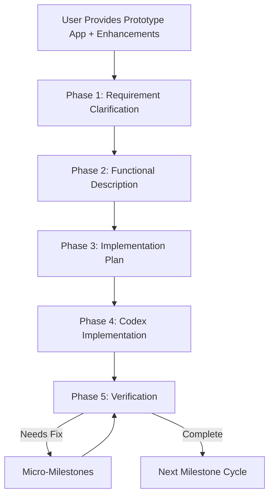
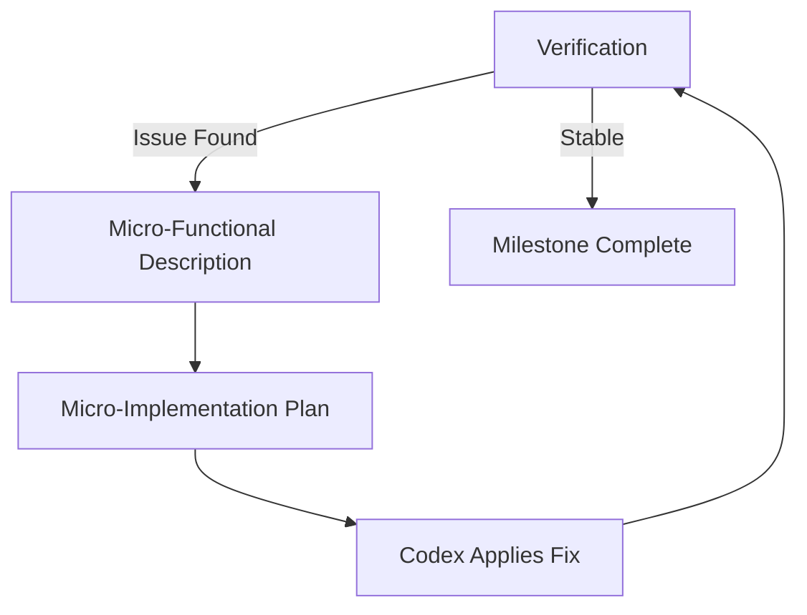

# LLM-Assisted Development Workflow Guide

## 1. Purpose and Scope
This guide defines a systematic, repeatable workflow for developing and enhancing **interactive JavaScript applications** using:

- Human expertise and oversight  
- ChatGPT for requirements analysis, planning, and specification  
- Codex (VS Code with the OpenAI coding module) for implementation

The workflow emphasizes clarity, reproducibility, and small, verifiable steps. Each development cycle improves the application through a numbered milestone such as **1.16.1**, **1.16.2**, etc., with optional micro-milestones such as **1.16.1.1**.

---

## 2. Guiding Principles
- **Iterative Improvement:** Each cycle implements one milestone’s worth of enhancements.
- **Clarity Before Coding:** Ambiguous instructions must be resolved *before* producing a functional description or implementation plan.
- **Executability:** Functional descriptions must be detailed enough that Codex can implement them without guessing.
- **Structured Versioning:**
  - Milestones increment the last decimal (1.16.1 → 1.16.2).  
  - Micro-milestones add a deeper decimal (1.16.1.1 → 1.16.1.2).  
  - Numbers such as **1.16.0** serve only as *anchors*, not actual versions.
- **Small, Reliable Changes:** Each milestone should be feasible to complete in a single Codex session.

---

## 3. Versioning Terminology
A version number consists of **four hierarchical components**:

```
<major release>.<minor release>.<milestone>.<micro-milestone>
```

Example:
```
1.16.3.2
```

### 3.1 Major Release
Large conceptual changes or public releases.

### 3.2 Minor Release
A group of related feature improvements.

### 3.3 Milestone
A planned unit of work that **should be implementable using one Codex prompt**.

### 3.4 Micro-Milestone
A corrective unit of work inserted **only as needed**, typically for regressions.

---

## 4. Mermaid Diagram — Versioning Hierarchy
```{mermaid}
flowchart TD
    A[Version Number] --> B[Major Release]
    A --> C[Minor Release]
    A --> D[Milestone]
    A --> E[Micro-Milestone]
```

---

## 5. High-Level Workflow
Each cycle follows these phases:

1. **Phase 1 — Requirement Gathering & Clarification**  
2. **Phase 2 — Functional Description**  
3. **Phase 3 — Implementation Plan**  
4. **Phase 4 — Codex Implementation**  
5. **Phase 5 — Verification & Micro-Milestones**

---

## 6. Mermaid Diagram — Workflow Overview


---

## 7. Phase 1 — Requirement Gathering & Clarification
This phase ensures that all enhancement requests become **clear, testable, and unambiguous requirements**.

### 7.1 Intake of Requirements
- Identify ambiguous statements  
- Detect missing constraints  
- Resolve conflicting requirements

### 7.2 Clarification Dialogue
ChatGPT asks targeted questions until the requirements are:

- Fully specified  
- Testable  
- Unambiguous  
- Matched to the intended milestone number

### 7.3 Requirement Sources
This phase handles all input types:

- User-supplied descriptions  
- ChatGPT-generated drafts based on high-level goals  
- Hybrid descriptions refined jointly

### 7.4 Exit Criteria
- All requirements are explicit and understood  
- The milestone version (e.g., **1.16.1**) is confirmed  
- Ready to create a functional description

---

## 8. Phase 2 — Functional Description
A **formal specification** of everything to be implemented in the milestone.

### 8.1 Contents
- Purpose and scope of the milestone  
- UI behaviors, event flows, and interactions  
- Data transformations & algorithms  
- File-level responsibilities  
- Constraints and edge cases

### 8.2 Exit Criteria
A document sufficiently detailed for Codex to implement directly.

---

## 9. Phase 3 — Implementation Plan
A procedural plan specifying the exact changes Codex will perform.

### 9.1 Contents
- Files to modify or create  
- Exact insertions, deletions, and updates  
- Function and variable names  
- Module dependencies  
- Notes for post-implementation testing

---

## 10. Phase 4 — Codex Implementation
Codex performs the code modifications as specified.

### 10.1 Developer Responsibilities
- Provide the implementation plan to Codex  
- Test the updated app after Codex completes the changes  
- Identify regressions or missing behaviors

---

## 11. Phase 5 — Verification & Micro-Milestones
### 11.1 Testing
The user tests for:
- Functional correctness  
- UI/UX correctness  
- Performance  
- Stability and errors

### 11.2 Issue Identification
If problems arise, they are returned to ChatGPT.

### 11.3 Micro-Milestone Loop
For each corrective step:

1. ChatGPT produces a micro-functional description.  
2. ChatGPT produces a micro-implementation plan.  
3. Codex applies the fix.  
4. User re-tests.

### 11.4 Exit Criteria
The milestone is complete when all corrections are finished and stable.

---

## 12. Mermaid Diagram — Micro-Milestone Loop


---

## 13. Best Practices
### 13.1 For the User
- Keep milestones small  
- Provide concrete test cases  
- Document regression issues precisely

### 13.2 For ChatGPT
- Identify ambiguities early  
- Produce deterministic, codifiable descriptions  
- Maintain consistent terminology

### 13.3 For Codex
- Follow the implementation plan faithfully  
- Apply minimal diffs  
- Avoid unrequested structural changes

---

## 14. Appendix Materials (Future Work)
- Templates for functional descriptions  
- Templates for implementation plans  
- Common pitfalls  
- Recommended JS app layout
